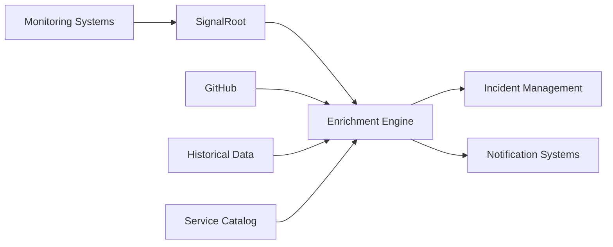

# Overview

SignalRoot is an advanced alert enrichment platform that transforms your raw alerts into actionable incidents with deployment context and historical insights.

## What is SignalRoot?

SignalRoot sits between your monitoring systems and your incident response workflow, automatically enriching alerts with:

- **Deployment Context**: Correlates alerts with recent code deployments
- **Historical Analysis**: Finds similar incidents from your past
- **Impact Assessment**: Determines potential business impact
- **Automated Triage**: Routes alerts to the right teams automatically

## Key Features

### 🚀 **Alert Enrichment**
- Automatic correlation with GitHub deployments
- Similar incident detection and analysis
- Service impact mapping
- Severity assessment based on historical data

### 🔗 **Integration Hub**
- Webhook support for PagerDuty, CloudWatch, GitHub
- Slack and email notifications
- REST API for custom integrations
- SDK for programmatic access

### 📊 **Intelligence Layer**
- Machine learning for pattern recognition
- Automated incident timeline generation
- Suggested resolution steps
- Performance metrics and insights

### 🛠️ **Operations Ready**
- Docker containerization
- Kubernetes manifests
- Monitoring and logging built-in
- Multi-environment support

## How It Works

### 1. Ingestion
SignalRoot receives alerts from multiple sources:
- **PagerDuty** incidents
- **CloudWatch** alarms
- **GitHub** deployments and issues
- **Custom webhooks** from any monitoring tool

### 2. Enrichment
Each alert is processed through our enrichment pipeline:
- **Correlation**: Links alerts to recent deployments
- **Analysis**: Finds patterns in historical incidents
- **Context**: Adds service and team information
- **Prioritization**: Calculates business impact

### 3. Distribution
Enriched alerts are sent to:
- **Incident management** systems with full context
- **Communication platforms** (Slack, Teams, etc.)
- **On-call engineers** with actionable information
- **Dashboards** for real-time monitoring

## Architecture Overview

SignalRoot is built with a microservices architecture:

- **API Gateway**: Request routing and authentication
- **Enrichment Service**: Core alert processing logic
- **Correlation Engine**: Deployment and incident matching
- **Notification Service**: Multi-channel alert delivery
- **Analytics Service**: Pattern recognition and insights

## Benefits

### 🎯 **Faster Resolution**
- 60% reduction in mean time to resolution (MTTR)
- Automated context gathering saves investigation time
- Suggested resolutions based on historical data

### 📈 **Better Insights**
- Trend analysis across incidents
- Service reliability metrics
- Team performance analytics
- Deployment impact assessment

### 🔄 **Improved Workflow**
- Automated alert triage and routing
- Reduced alert fatigue for on-call engineers
- Consistent incident handling processes
- Integration with existing tools

## Getting Started

Ready to dive in? Check out our [Quick Start guide](./quickstart) to get SignalRoot running in minutes.

For detailed API information, see our [API Reference](./api-overview).

## Need Help?

- **Documentation**: Browse our complete guides
- **Community**: Join our [Discord server](https://discord.gg/signalroot)
- **Support**: Email us at support@signalroot.com
- **Issues**: Report bugs on [GitHub](https://github.com/signalroot/signalroot/issues)
